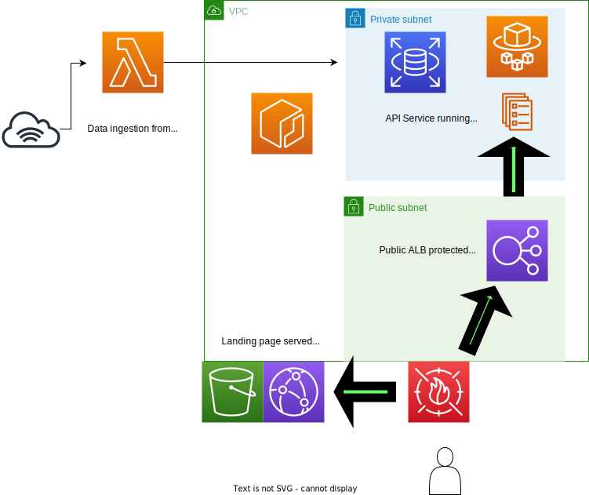

# Code Corpus API

This will be an API publicly available to grab selections from corpora of four different languages:

- Javascript
- Typescript
- Python
- Golang

Initially, it will only return functions, since that's the first thing I'm creating a corpus of. I'm expecting later to be able to provide various other things like control flow examples, variable declarations, and other interesting things.

## System Architecture



## Separation of frontend and backend

There will be a frontend landing page at the bare domain (`https://codecorpus.net`), along with possibly a swagger spec, and then the actual API will live at a subdomain like `https://api.codecorpus.net` with path/query based routing to particular handlers.

## Operational components

These are going to be in a different repo, since they're things that I'm personally interested in, and not strictly necessary to get this particular API up and running:

- Monitoring

Some sort of prometheus instrumentation of the application itself, along with ELB metrics, either via cloudwatch directly or some sort of exporter. Maybe something like https://promcat.io/apps/aws-elb.

We definitely want Latency, Traffic, and Errors.

- Dashboards

Definitely grafana, but just need to decide on a data source. Probably prometheus with optional other stuff.

- Logging

This could be something like a full ELK stack, but might end up being a bit slimmer, depending on cost and what's easy to implement.

- Security

Depending on how much of a rabbit-hole it ends up being, I might also look into some fuzzing in CI (don't really have a staging environment, so that's probably the best we can do for now).

## Things the API will return

> (this will eventually be a swagger spec or something, but for now just writing down thoughts)


### Implemented

- one random function for a particular language
- N functions for a particular language (This is going to use pagination...and the "next" token isn't implemented yet)


### Not yet implemented

- list of repos for a given language (paginate this)
- one random function for a particular repo

Considerations for different "filters" on the query:

- filter functions by number of lines (probably both `maxLines` and `minLines`)
- filter functions by "difficulty" (we'll probably have to just use number of lines here, though an eventual analysis of the actual corpus could help us figure out a better metric)
- filter functions by "internal criteria", for example whether the function contains a particular control flow like `if` blocks, or whether it has a return value or not. This is aspirational for the time being, since the currently data collection method doesn't annotate functions with any of this information.

Metadata that we might want to have available for API results:

- owner/repository
- full URL to the original file (we might be interested in actual line numbers for the function definition, but we need a strategy to keep the data fresh if we go this route...we could _maybe_ get around this if we also grabbed that actual commit SHA, which presumably could always get us to the original function, even if later commits change what's in the HEAD of the file)
- date retrieved
- language of the function

## Data model

The database will have the following tables:

1) language
2) source repository
3) code

### language

```
ID | language
0  | python
1  | golang
2  | javascript
3  | typescript
```

### source repository

```
ID | URL
0  | https://github.com/owner/repo_name1
1  | https://github.com/owner/repo_name2
2  | https://github.com/owner/repo_name3
...
```

### code

> This is the only table that currently exists, but we might set up other ones, as above, depending on what features we decide to implement.

```
ID | language | repo | number_of_lines | code
0  | 1        | 4    | 8               | [{"line_number": 1, "line_content": "function get(req, res, next) {"}, ...]
...
```


Open questions:

- Do we actually want to return data structures like what's currently used for the parsons problems web app? ie, with code as an array of objects of the form `[{"line_number":3, line_content: "    return computedValue"}...]`? It could be that allowing clients to do that parsing if they want to is cleaner and couples the data less to a particular expected usage (like parsons problems). The biggest problem is I have absolutely no idea how people would want to actually use this, so I might as well just return a very general data structure and then iterate based on actual feedback, if there is any.
- Do we want to also grab tests, and present them? If so, we probably want to add a `test: true` field for the metadata, probably defaulting to _not_ providing functions from test files.
