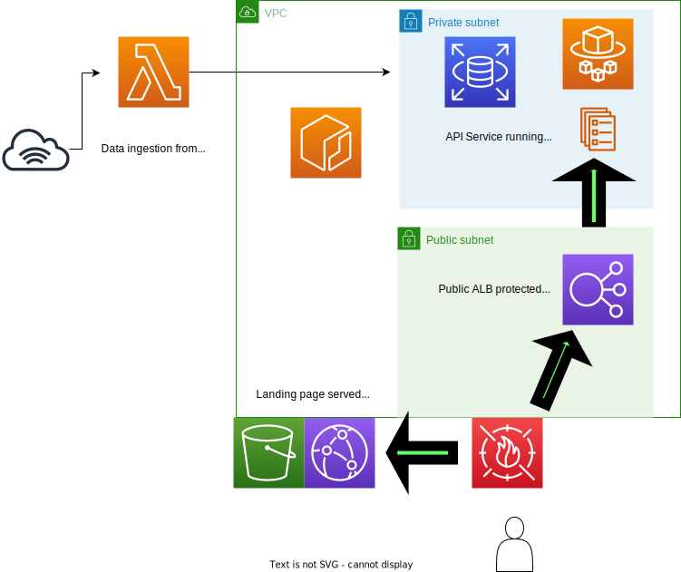

# Code Corpus API

This will be an API publicly available to grab selections from corpora of four different languages:

- Javascript
- Typescript
- Python
- Golang

Initially, it will only return functions, since that's the first thing I'm creating a corpus of. I'm expecting later to be able to provided various other things like control flow examples, variable declarations, and other interesting things.

## System Architecture

